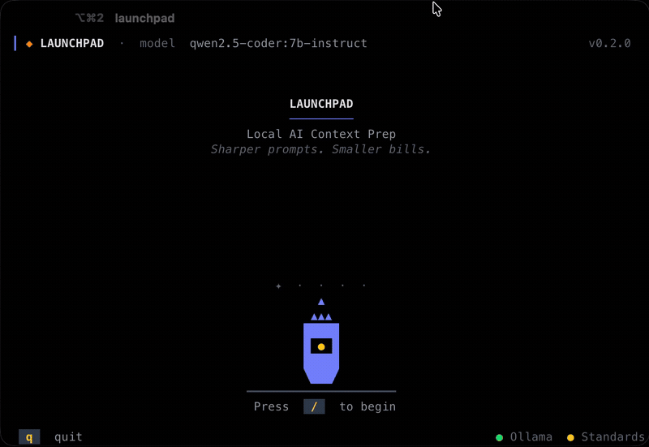
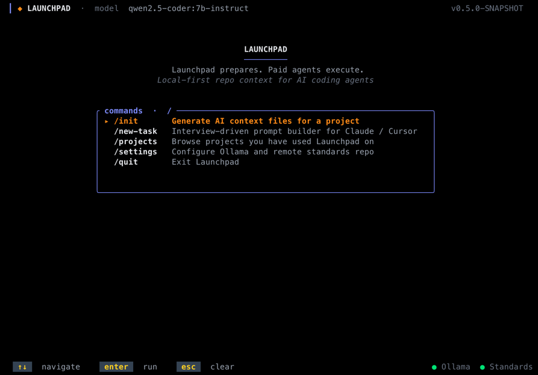
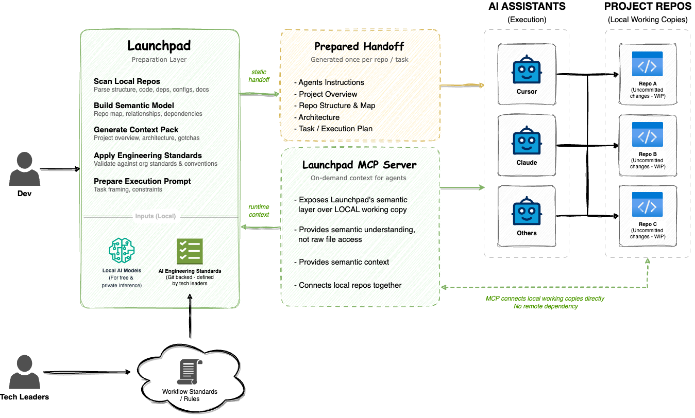

# Launchpad

Launchpad prepares a repository for AI-assisted development before the agent starts. It scans locally, resolves engineering standards, and emits grounded project context through `AGENTS.md`, `.ai/*`, and `.launchpad/*` sidecars.

Standards-first, not standards-after.

> **Note:**
> Launchpad is still in its early stages and currently supports **Spring Boot Java** projects on **Maven or Gradle** only.
>
> The scope is intentionally narrow while the core experience around local-first context generation, standards packs, and AI-assisted development workflows continues to mature.

---

## How it works

---

## What it does

- **Scans your project deterministically** -- extracts structure, dependencies, endpoints, and documentation without guessing
- **Resolves your engineering standards** -- rules, skills, and checklists from a YAML pack you control
- **Generates grounded context files** -- `AGENTS.md` + `.ai/*` ready before the agent starts
- **Runs entirely locally** -- Ollama or any OpenAI-compatible endpoint; your code never leaves your machine
- **Works with any AI tool** -- Claude Code, Cursor, Windsurf, or anything that reads `AGENTS.md`

---

## Local AI providers

Ollama, LM Studio, llama.cpp, vLLM -- anything with an OpenAI-compatible endpoint works.
Default: Ollama at `http://localhost:11434`.

---

[Docs](docs/index.adoc) | [Getting Started](docs/getting-started.adoc) | [MIT License](LICENSE) | [Issues](https://github.com/acltabontabon/launchpad/issues)
